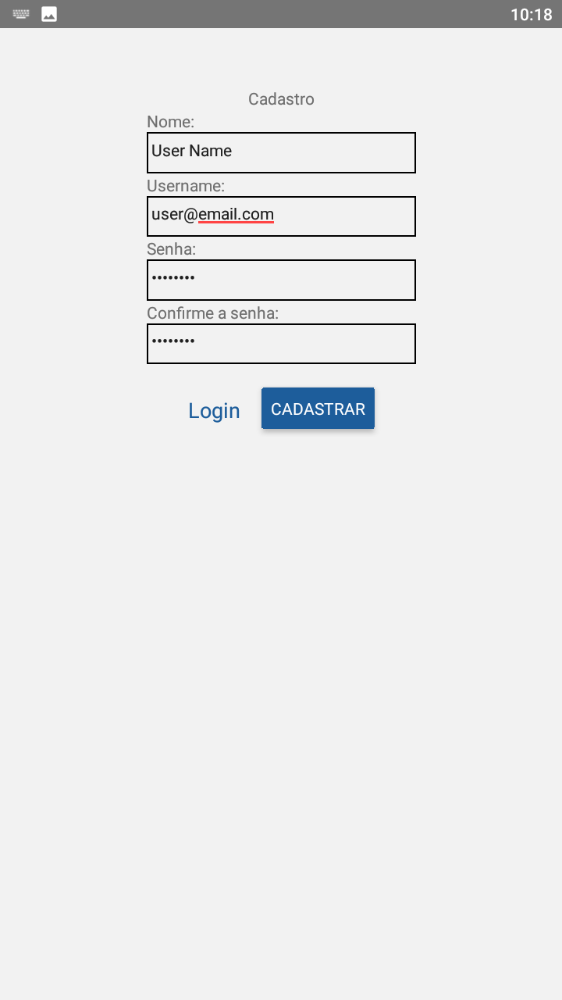
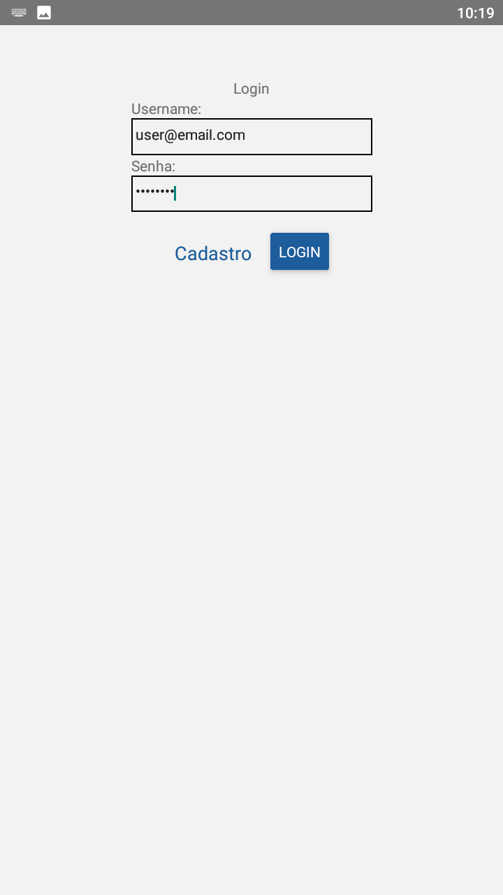
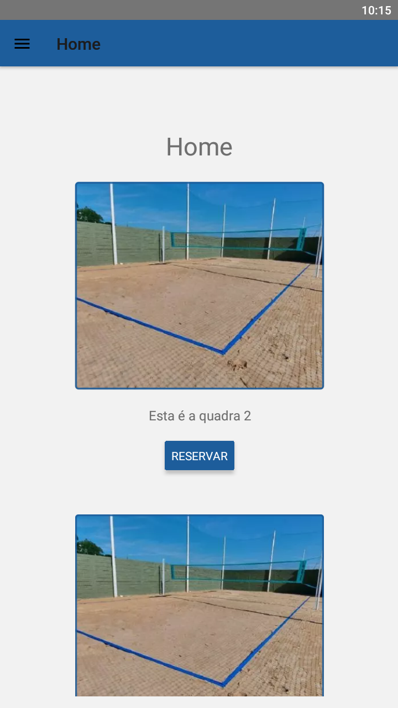
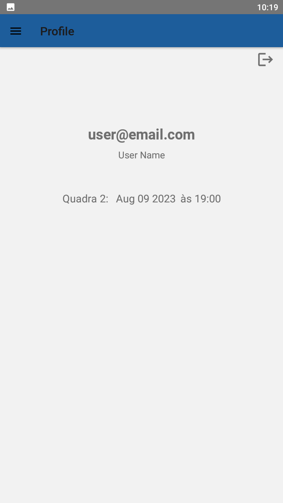
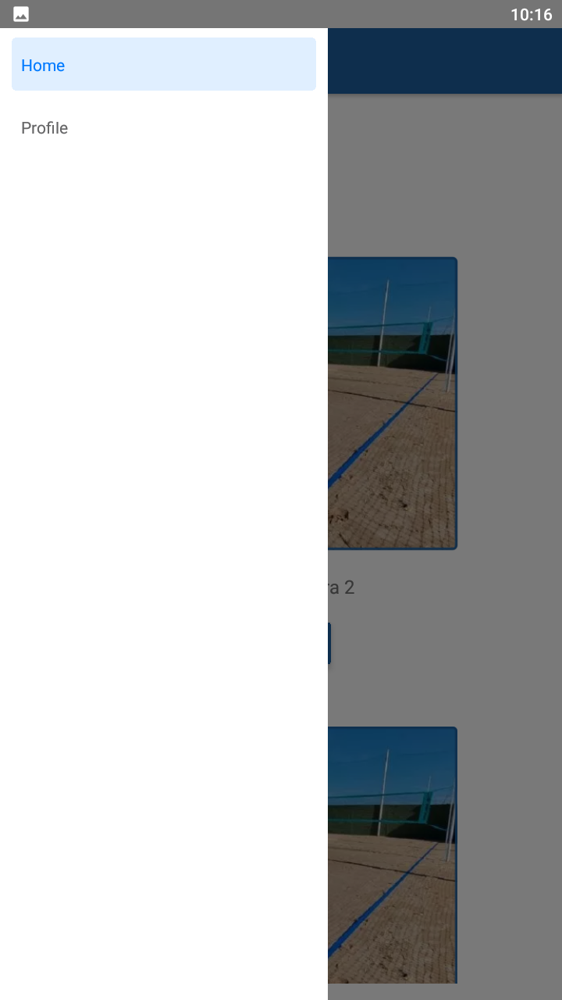

# VolleyReserves

## Índice

- <a href="#funcionalidades" >Funcionalidades</a>
- <a href="layout">Layout</a>
- <a href="#tecnologias-utilizadas" >Tecnologias utilizadas</a>
- <a href="como-executar">Como executar</a>
- <a href="autores">Autores</a>
- <a href="tarefas-futuras">Tarefas Futuras</a>

## Funcionalidades

- [x] Autenticação de usuário
- [x] Menu de opções para reserva de quadras
- [x] Reservar horários
- [x] Exibir horários reservados

## Layout

### Usuário não autenticado

<div style="display:flex">
  
  
</div>

### Usuário autenticado

<div style="display:flex">
  
  
  
</div>

## Tecnologias utilizadas

- [React Native](https://reactnative.dev/)
- [Firebase](https://firebase.google.com/docs/guides)
- [React Native Firebase](https://rnfirebase.io/)

## Como executar

### Clone este repositório

Abra o terminal na pasta onde o projeto será criado e execute o seguinte comando.

```
$ git clone https://github.com/bruno743/volleyreserves.git
```

### Configure o projeto no [Firebase](https://console.firebase.google.com/)

Ao criar o projeto é preciso salvar o arquivo **google-services.json** que será gerado em **./android/app**.
Com o projeto criado, no console do Firebase, é preciso adicionar as funções de autenticação e firestore ao projeto.

Link que pode ajudar: [Setup Firebase](https://www.youtube.com/watch?v=W39H-IwMkAw).

### Instale as dependências e execute

Com o terminal aberto na pasta raíz da aplicação execute os seguintes comandos.

```
# Instale as dependências
$ npm install

# Execute
$ npm start
```

Para a execução da aplicação desta forma é preciso ter um emulador configurado na máquina. Uma outra alternativa é instalar o
arquivo **./android/app/build/outputs/apk/debug/apk-debug.apk** diretamente em seu dispositivo.

## Autores


[Linkedin](https://www.linkedin.com/in/bruno-felipe-608a85219/)

## Tarefas Futuras

- Adicionar funcionalidade que simula pagamento
- Melhorar os estilos
